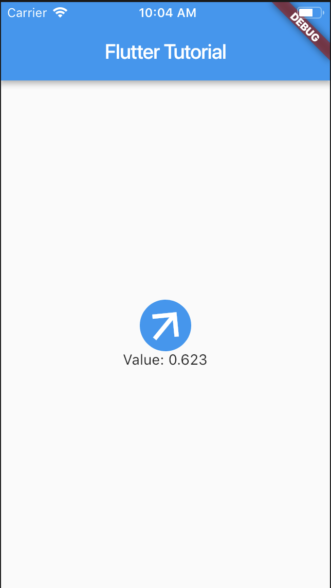
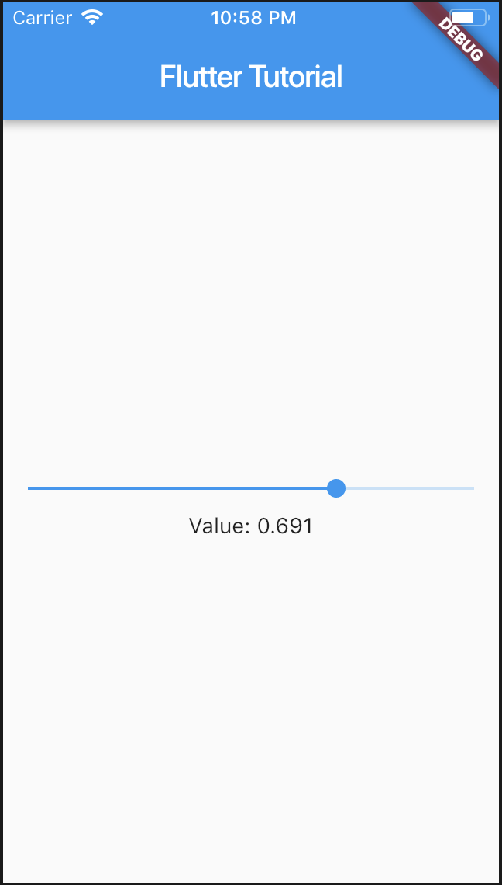
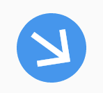

# Flutter Tutorial - Custom User Input Knob using GuestureDetector

Comments

- Decide on a case for Flutter?
- Can you make stuff foldable/unfoldable? (like long code snippets)
- Decide on a case for Widget
- Not sure I like the whole future tense tone throughout the article "We will", sounds a bit like a paper and wordy. Might just be a personal preference though, please keep it if you prefer :)
- squash together hello world and slider
- Keywords in content and title 

## Intro

Flutter is an open source portable UI toolkit made by Google, which is great for cross platform app development. Blah blah... for more
One of the great things about Flutter that no other cross platform app development tool can do is to define new custom UI elements using nothing but Dart code.
In this Flutter tutorial I will demonstrate how easy it is to create your own custom UI elements from scratch.

A common UI element, especially in music software applications is a knob.


<figcaption>The software synthesiser <i>Massive</i>. Note the 31 Knobs in the UI</figcaption>

In [Flutter's widget catalogue](https://flutter.dev/docs/development/ui/widgets) there is no knob element for us to use out of the box, however it is easy to make your own (the full source code of mine is avaliable here (LINK)).

[do TLDR thing here]
[Make a gif version of this!]

Flutter already has a widget with a very similar behaviour to the one we are creating, the `Slider` widget (you can see the full source code for Slider here: (LINK)).
The key difference between the slider and the knob we wish to create is visual: a slider converts a linear input guesture to a linear animation whereas the our knob will convert a linear input guesture to a rotational animation (The more complicated version a knob which uses a rotational guesture instead will be covered in a future tutorial).

I will assume you have a basic knowledge of Flutter, Dart, Stateless and Stateful widgets, and have seen Flutter's "hello world" app, the `Counter App` (created by running the terminal command `flutter create .` or using the command `Flutter: New Project` in vscode). (See this tutorial (LINK) to get you started otherwise).

## Basic setup

We will start from a simple testbed for our new custom widget using a `Slider` widget, and a `Text` widget to display the slider's value. (TODO: Make a GIF instead of static image)



The following code is based off the `Counter App` (See introduction).

File: `main.dart`

```
import 'package:flutter/material.dart';

void main() => runApp(MyApp());

class MyApp extends StatelessWidget {
  @override
  Widget build(BuildContext context) {
    return MaterialApp(
      home: MyHomePage(),
    );
  }
}

class MyHomePage extends StatefulWidget {
  @override
  _MyHomePageState createState() => _MyHomePageState();
}

class _MyHomePageState extends State<MyHomePage> {
  // A variable to store the slider's value
  double _value = 0.0;  
  // A callback for the slider to use to modify the its value
  void _setValue(double value) => setState(() => _value = value);

  @override
  Widget build(BuildContext context) {
    return Scaffold(
      appBar: AppBar(
        title: Text('Flutter Tutorial'),
      ),
      body: Center(
        child: Column(
          mainAxisAlignment: MainAxisAlignment.center,
          children: <Widget>[
            Slider(value: _value, onChanged: _setValue),
            Text(
              'Value: ${_value.toStringAsFixed(3)}',
            ),
          ],
        ),
      ),
    );
  }
}
```

In the `_MyHomePageState` widget's state we have a `_value` attribute used to store the current value of the slider and a `_setValue` function used by the slider to modify this value.

```
class _MyHomePageState extends State<MyHomePage> {
  double _value = 0.0;
  void _setValue(double value) => setState(() => _value = value);
  ...
```

The slider's interface is very simple. To use it, simply add it to the `_MyHomePageState` widget's `build` method, and pass it `_value` and `_setValue` as parameters.

```
Slider(value: _value, onChanged: _setValue),
```

The `Text` widget is also passed `_value` as a parameter, however we round it to 3 decimal places.
```
Text(
  'Value: ${_value.toStringAsFixed(3)}',
),
```

## The design bit: Custom knob widget appearance

First we will design a simple knob. There are two approaches to making a new UI widget from scratch:
<div style="display flex">
  
  
</div>

- _Composing_ together other widgets (left). This is the easiest option, used here.
- Using the CustomPaint widget (right) to paint the widget at a low level out of lines, circles, arcs etc. This is the most powerful option and will be covered in a future tutorial.


We will make the knob out of a circle and an arrow icon. This can be customised much more and you can use whatever widget or design you want, but we'll keep it simple for now.

```
ClipOval(
  child: Container(
    color: Colors.blue,
    child: Icon(Icons.arrow_upward,
      color: Colors.white,
      size: 50,
    )
  )
),
```

## Simple behaviour: Custom Knob Widget - Continuous

In this tutorial we will make the knob respond to continuous values. The next tutorial will address discrete values which a bit trickier to handle.
There are two key parts to making a knob. Firstly we need the knob widget to respond to the `_value` attribute, and then we need to make it respond to the user input by calling `_setValue` method.

### Part 1: Visually respond to \_value

To make our knob rotate we can simply wrap it in a rotation widget.
It needs to rotate from a minimum angle to a maximum angle as the value changes from 0 to 1.

To do this we will need to do a little bit of maths so let's import Dart's math library:

```
import 'dart:math';
```

This lets us use `pi` to get the value Pi (3.1415...)

As the arrow marker starts pointing vertically, we will set the minimum angle as -160° and the maximum angle as +160°. The total sweep angle is therefore 320° (See diagram). We want the final angle to be in radians.

To map our `_value` variable to the desired angle, we can do the caculation at the start of the build method:

```
class _MyHomePageState extends State<MyHomePage> {
  double _value = 0.0;
  void _setValue(double value) => setState(() => _value = value);

  static const double minAngle = -160;
  static const double maxAngle = 160;
  static const double sweepAngle = maxAngle - minAngle;

  @override
  Widget build(BuildContext context) {
    double _angle = ((minAngle + (_value*(sweepAngle))) / 360) * 2 * pi;
    return Scaffold(
      ...
```

We can then simply wrap our widgets in a `Transform.rotate()` widget, and simply pass it our new computed angle:

```
Transform.rotate(
  angle: _angle,
  child: ClipOval(
    child: Container(
      color: Colors.blue,
      child: Icon(Icons.arrow_upward,
        color: Colors.white,
        size: 50,
      )
    )
  ),
),
```

Now if we move the slider, our knob should respond correctly.
(GIF) Link to full source code up to here
This pattern of using a slider (or several sliders) to test the behaviour of another UI element is very useful when testing the new UI element, as it allows you to get the visual behaviour correct before working on the actual user input.

### Part 2: Respond to user input

In this section we will make the knob actually respond to being dragged. We will make the knob such that it rotates when the user drags it in a vertical direction (More complicated behaviours are possible, such as making the knob rotate as the user drags in a circle around it, or adding momentum and viscocity to the knob, but we'll save these for another time).

The first step is to wrap our knob in a GestureDetector, and provide a onVerticalDragUpdate function which sets what happens when the user drags the knob in a vertical direction.

```
Transform.rotate(
  angle: _angle,
  child: GestureDetector(
    onVerticalDragUpdate: (DragUpdateDetails details) {
      double changeInY = details.delta.dy;
      print(changeInY);
      // Respond to the changeInY
    },
    child: ClipOval(
      ...
    ),
  ),
),
```

Now when you drag on the knob, you should see values being printed in the debug console. The values represent the number of pixels that you have moved. You'll notice that dragging upwards gives a negatve value, so we need to account for this by changing the logic to `double changeInY = -details.delta.dy;`
(See GIF)

Now we need to use these `changeInY` value to actually change the angle. The steps are as follows:

- Convert the `changeInY` value to a change in `_value`.
- Add this `changeInValue` to the current value.
- Limit the resulting value to be between 0 and 1.
- call `_setValue` with the new value

(Yet another "First we will".........) First we will define a constant which is the number needed to map from `changeInY` to `changeInValue`:

```
class _MyHomePageState extends State<MyHomePage> {
  ...
  static const double distanceToAngle = 0.007;
  ...
```

Now we use this in the onVerticalDragUpdate method:

```
onVerticalDragUpdate: (DragUpdateDetails details) {
  double changeInY = - details.delta.dy;
  double changeInValue = distanceToAngle * changeInY; // Note the negative sign
  double newValue = _value + changeInValue;
  double clippedValue = min(max(newValue, 0), 1);

  _setValue(clippedValue)
},
```

Now that we have a fully functioning knob, let's tidy up our code and move the knob into its own component.

### Moving the knob into a Stateless Component

### Setting a min/max value for the knob

The Slider widget has min & max parameters, and this will also be needed to make our knob useful.

- Show how to use linear interpolation to combine min, max and value to get normalised_value (NICE PICTURE OF LINEAR INTERPOLATION)
  value_norm = (value-min)/(max-min)

- Show how to use linear interpolation to combine min, max and normalised_value to get value
  value = min + value_norm \* (max - min)

- Add min and max params to the knob widget to set range and show the linear interpolation? (Or do this later on once the basic knob is working)

## other ideas...

### Make background for knob with ticks??

### Bonus: Use \_value to add more styling to knob??

Show changing the border thickness of the knob

### Bonus: Put use GIF for knobface??

# Blog article pt.2 make the knob handle interger values?

In the previous article we made a simple knob that handles continuous input values, using a stateless widget and a guesture detector.

In this article we will make the knob handle integer values. Do do this our knob now needs some internal state: we need to store a continuous internal value for display purposes.
